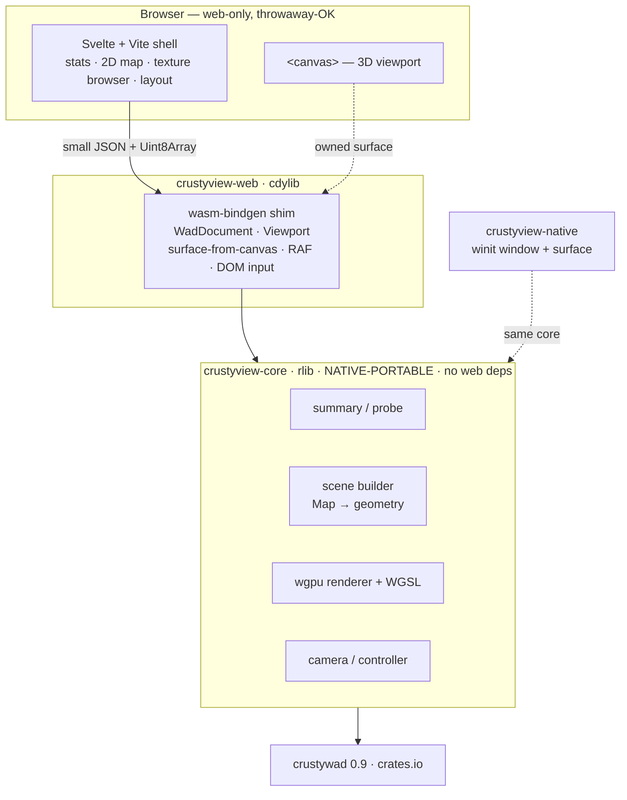
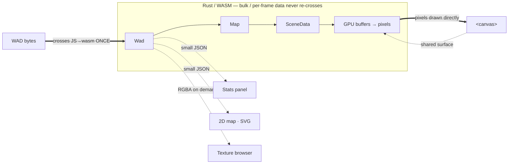
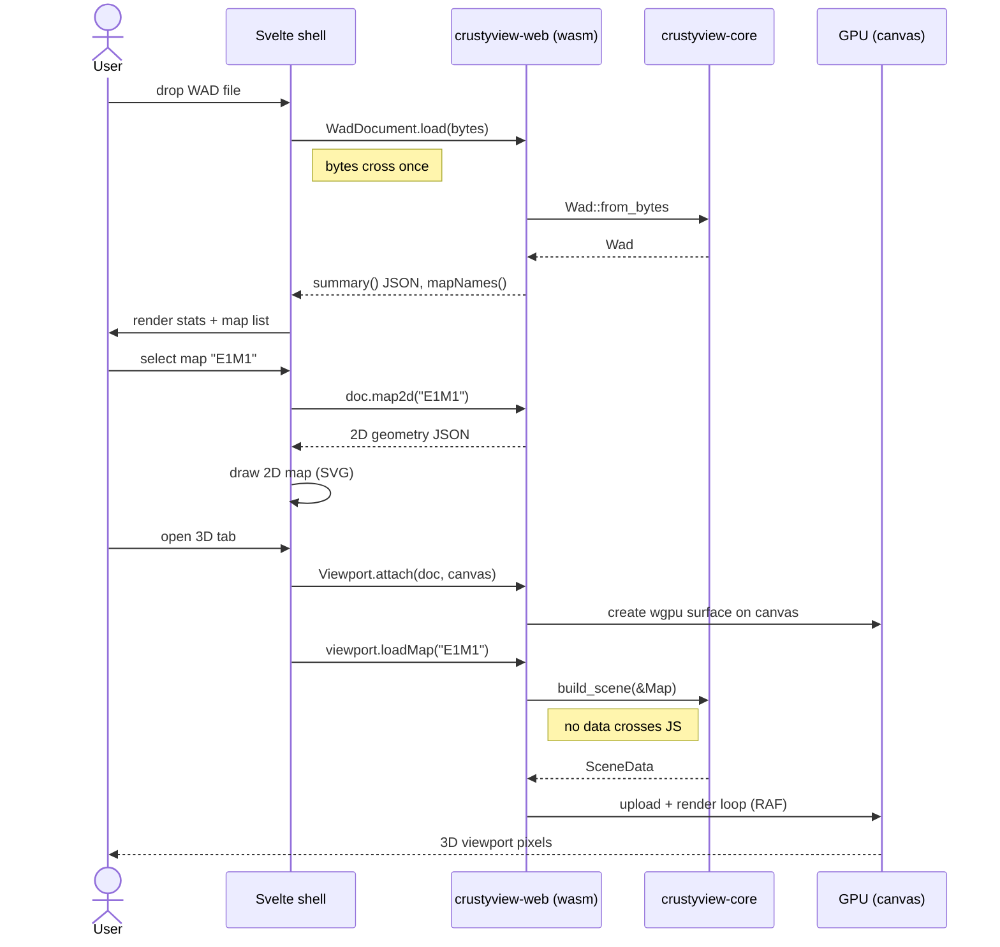
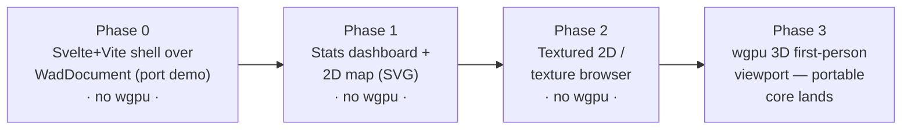

# ADR-0002: Hybrid UI architecture — a portable Rust/wgpu core behind a Svelte web shell

- **Status:** Accepted — amended by [ADR-0006](0006-webgl2-2d-renderer-succession.md):
  TypeScript may target WebGL2 for the 2D map when measured performance demands it;
  `wgpu` and portable Rust remain 3D-only
- **Date:** 2026-08-05
- **Deciders:** Amir Masri (with collaborative design)
- **Tracking issue / PR:** #12 · PR #6 (`docs/adr-0002-ui-architecture`)

## Context and problem statement

[ADR-0001](0001-consume-crustywad-via-pinned-wasm.md) validated that `crustywad`
reads WADs under `wasm32`, but deliberately left the **UI-framework choice
open** — (A) an all-Rust WASM UI (egui/bevy) versus (D) a Rust-WASM core with a
TypeScript UI. That choice gates the renderer and the eventual first-person 3D
viewport. `crustyview` is a stop-gap toward a future **native Rust** editor, and
the 3D viewport is roughly 80% of the eventual effort — so the question is not
merely "which web framework", but: **how do we structure the UI and renderer so
the expensive work carries forward to the native editor, without giving up a
pragmatic, ergonomic web experience?**

## Decision drivers

- **Don't build the expensive part twice.** The 3D viewport is the costliest
  artifact and the one we least want to rewrite for native.
- **Reuse the expensive part toward the native editor**, and make that
  reusability a *compile-time invariant* rather than a discipline.
- **Keep a pragmatic, ergonomic web shell.** The cheap parts (stats, 2D, layout)
  should use the friendly web ecosystem and are acceptable to rewrite for native.
- **3D must not gate the early wins.** Stats and the 2D map should ship long
  before any renderer exists.
- **Client-side, no server; privacy-preserving** (inherited from ADR-0001).
- **Dogfood `crustywad` toward 1.0** by exercising its read/geometry API from a
  real renderer.

## Considered options

1. **All-Rust WASM UI — egui/eframe** (immediate-mode GUI, custom `wgpu` paint
   callback for the viewport).
2. **All-Rust WASM UI — bevy** (ECS game engine owning the whole app).
3. **Rust-WASM core + TypeScript UI with Three.js for 3D** (option D from
   ADR-0001, drawing the reuse boundary at "parse/geometry core only").
4. **Hybrid: a portable Rust/`wgpu` core (parse → scene → renderer → camera)
   behind a Svelte + TypeScript web shell** — `wgpu` for 3D, everything 2D and
   DOM in TypeScript. *(Chosen.)*

## Decision outcome

Chosen option: **4 — the hybrid.** The reuse boundary is drawn by two costs —
**cost to rebuild for native** and **cost to marshal across the wasm↔JS
boundary**. The expensive 3D path (scene building, `wgpu` renderer, camera) is
kept in **native-portable Rust** so it ports to the native editor 1:1; the cheap
shell (file loading, stats, 2D map, layout) is kept in **web-ergonomic,
throwaway-OK TypeScript/Svelte**. `wgpu` abstracts the graphics backend
(WebGPU/WebGL2 on web; Vulkan/Metal/DX on native), so the renderer logic, WGSL
shaders, scene builder, and camera math are identical across platforms — only a
few hundred lines of surface acquisition, event-loop, and input glue differ.

**Three.js is explicitly excluded** for 3D: 3D is precisely the
expensive-to-rebuild part we chose to keep in portable Rust, so routing it
through a JavaScript engine would forfeit the reuse this decision exists to
capture.

**Svelte** is chosen for the shell (over React and vanilla) because the viewer's
reactive surface is small and coarse — app phase, selected map, selected
texture, a few view toggles — while a large fraction of the app is *imperative*
(a 2D canvas and the `wgpu` viewport). Svelte's minimal-boilerplate reactive
stores fit the former, and its single-fire `onMount`/`onDestroy` lifecycle
integrates the long-lived imperative `wgpu` object more cleanly than React's
effect model (whose dev-mode double-invocation is a footgun for GPU-context
lifecycles).

### Crate structure — portability as a compile-time invariant

The single `crustyview` crate is split into three:

- **`crustyview-core`** (`rlib`, **native-portable, zero web dependencies**) —
  `summary`, `probe`, and three new reusable pieces: `scene`
  (`crustywad::map::Map` → renderable geometry), `renderer` (`wgpu` pipelines +
  WGSL + render passes), and `camera` (controller math). Because it does not
  depend on `web-sys`, it *cannot* absorb browser code — the compiler enforces
  the boundary.
- **`crustyview-web`** (`cdylib`, wasm32-focused) — the `wasm-bindgen` shim only:
  surface-from-canvas, the `requestAnimationFrame` loop, DOM-input translation,
  and the `WadDocument` / `Viewport` exports.
- **`crustyview-native`** (starts as a portability-proving skeleton, **not** the
  editor) — a winit window + `wgpu` surface feeding the *same* core renderer once
  it exists (phase 3). Its near-term job is to keep the core honest: if the core
  ever reaches for a browser API, the native crate stops compiling. It grows into
  the editor much later.

### The wasm↔TS contract — two stateful handles

The WAD bytes cross the boundary **exactly once**. Thereafter TypeScript holds
*handles*; heavy data stays in Rust.

- **`WadDocument.load(bytes)`** parses the `Wad` once and holds it in wasm
  memory. Cheap queries then read from it without re-crossing the WAD:
  `.summary()`, `.mapNames()`, `.map2d(name)` (vertices, linedefs, things for
  the 2D view), and `.textureNames()` return small JSON; `.textureRgba(name)`
  returns one composited texture's RGBA bytes on demand for the texture browser
  (the bounded pixel carve-out noted in the boundary rule below).
- **`Viewport.attach(doc, canvas)`** (async — `wgpu` web init is async) creates
  the `wgpu` surface on the canvas TypeScript handed it. `.loadMap(name)` builds
  the scene from the document's already-parsed `Map` and uploads to the GPU —
  **no geometry crosses JS**. Plus `.resize(w, h)` and `.dispose()`.

**Boundary rule:** the bulk, per-frame data — the `Wad`, the `Map`, the
`SceneData`, and the 3D viewport's framebuffer — stays in Rust and goes straight
to the GPU; it never crosses into JavaScript. What crosses is small and
on-demand: derived JSON for the DOM panels (summary, `map2d`), plus one
composited **texture-preview RGBA at a time** for the texture browser — a
deliberate, bounded carve-out that is consistent with "2D/DOM = TypeScript" and
is nothing like shipping the whole scene across every frame. For the 3D
viewport, TypeScript owns the canvas *element* and Rust owns its *pixels*.

### Render loop, input, and ownership

Ownership is split so the **frame content is core** and the **loop driver is the
platform shim** — exactly how the native shim will differ later:

- The **RAF loop** lives in `crustyview-web`; each frame calls
  `controller.update(dt)` then `renderer.render(&camera)`, both in core. The
  native shim will drive the identical `renderer.render` from winit's event loop.
- **Input**: the web shim attaches pointer/keyboard/wheel listeners to its canvas
  and translates them into core `InputEvent`s fed to the `CameraController`
  (pointer-lock for mouselook on web, cursor-grab on native — same core
  controller). The native shim translates winit events into the same events.
- **Resize**: a `ResizeObserver` in the shim calls `renderer.resize` off the
  canvas's backing size — deliberately not routed through Svelte reactivity.

### Svelte shell shape

`App.svelte` hosts the header (file input + drag/drop), a tab bar (Stats / 2D /
3D), and the main pane. One store holds `wadDoc | null`, `phase`,
`selectedMap`, `selectedTexture`, and view toggles, with `$derived` summary and
map names off `wadDoc`. Panels: `StatsPanel`, `MapList` (sets `selectedMap`),
`Map2D` (owns a canvas/SVG, imperatively draws `doc.map2d(...)`),
`TextureBrowser`, and `Viewport3D` (`onMount` → `Viewport.attach`; `onDestroy` →
`dispose`; reacts to `selectedMap` → `viewport.loadMap`). The imperative panels
use `bind:this` + `onMount`/`onDestroy`.

### Error handling

The existing best-effort ethos holds. The *only* hard error is
`WadDocument.load` on a non-WAD → `phase = error` banner. A map that will not
assemble, a texture that will not composite, or a browser with no usable GPU
degrades **that panel/tab only** — the WAD stays loaded. The 3D tab is the sole
GPU-hard-dependency; if init fails it shows a message while stats and 2D keep
working. `wgpu` is configured with **WebGL2 fallback enabled** (WebGPU
preferred), so the viewport runs on browsers without WebGPU, at the cost of
WebGL2's feature limits (acceptable for a Doom viewer).

### Staging — so 3D never gates the early wins

The crisp line: **`wgpu` = 3D only; everything 2D and DOM = TypeScript.**

### Consequences

- Good, because the expensive 3D path (scene builder, `wgpu` renderer, camera)
  is portable Rust that carries to the native editor 1:1, and the split makes
  that portability a compile-time invariant rather than a discipline.
- Good, because the `scene` builder — the crown jewel — is unit-testable
  **native, with no GPU and no browser**, and the existing WAD-sweep harness
  extends to assert it never panics across the collection.
- Good, because the bulk, per-frame data (map geometry and the viewport
  framebuffer) never re-crosses the wasm↔JS boundary; only small, on-demand
  payloads do — derived JSON for the panels, and one texture-preview RGBA at a
  time for the browser.
- Good, because the shell uses the friendly web ecosystem and the early wins
  (stats, 2D map) ship before any renderer exists.
- Bad, because the project now spans two languages and a JS build pipeline
  (Vite + `wasm-pack`), and there is a `WadDocument`/`Viewport` contract to keep
  in sync across the boundary.
- Bad, because `wgpu` on the web needs a WebGL2 fallback path (and its feature
  limits) to run everywhere, and the `crustyview-native` crate is near-dead-weight
  until phase 3.
- Neutral, because Three.js is excluded for 3D, and egui remains a plausible
  *future* option for in-viewport tooling/gizmos (not the shell).

## Pros and cons of the options

### 1 — All-Rust WASM UI (egui/eframe)

- Good, because it maximizes reuse (one language, native + web from one
  codebase) and immediate-mode UI suits editor tooling.
- Bad, because egui's web ergonomics (text input, IME, accessibility, mobile,
  "web feel") are weaker than the DOM, and the whole shell — not just the
  expensive part — becomes Rust, spending reuse budget on the cheap parts too.

### 2 — All-Rust WASM UI (bevy)

- Good, because bevy ships a capable 3D renderer and scene graph out of the box.
- Bad, because an ECS game engine is overkill for a *tool*, it wants to own the
  whole app (not embed in a canvas), and its web bundle and compile times are
  heavy.

### 3 — Rust-WASM core + TypeScript UI with Three.js

- Good, because Three.js is mature and gets a 3D scene up fast with batteries
  (camera, controls, lighting).
- Bad, because it draws the reuse boundary too low: the 3D viewport — the
  expensive-to-rebuild part — is written in JavaScript and thrown away for
  native, which is exactly the outcome this project is trying to avoid.

### 4 — Hybrid: portable Rust/wgpu core + Svelte shell (chosen)

- Good, because it draws the boundary by cost-to-rebuild and cost-to-marshal:
  the expensive 3D path is portable Rust, the cheap shell is web-ergonomic and
  disposable, and the compile-enforced crate split guarantees the split holds.
- Bad, because it accepts two languages, a build pipeline, and a hand-maintained
  wasm↔JS contract as the price of that boundary.

## More information

- **Supersedes the open question in** [ADR-0001](0001-consume-crustywad-via-pinned-wasm.md)
  §Consequences ("the UI-framework choice remains open").
- **Implementation follows in phases** (table above); phase 0 revalidates the
  boundary and build pipeline with zero renderer risk before any `wgpu` work.
- **Revisit if:** the wasm↔JS marshalling for 2D/stats ever proves costly enough
  to want that data rendered in Rust too; egui-for-shell later beats Svelte for
  editor-grade tooling; or WebGL2's limits block a viewport feature and force a
  WebGPU-only stance.
